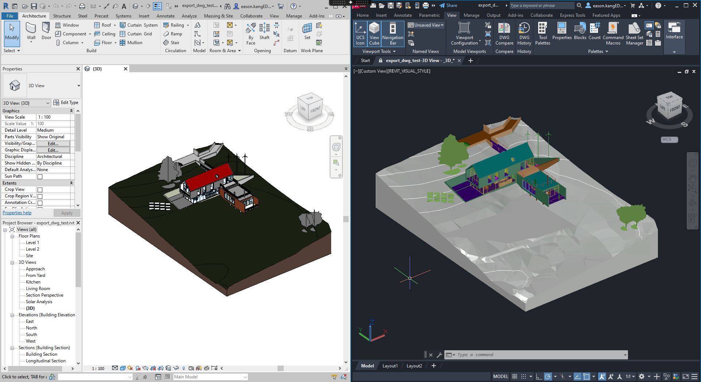
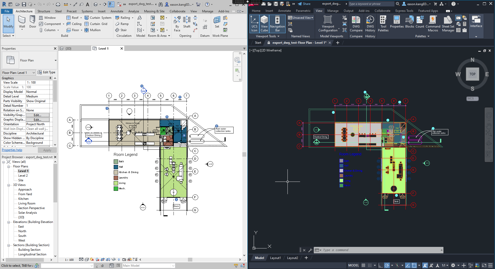

# Export DWG from Revit files with Design Automation

[](http://developer.autodesk.com/)


[](http://autodesk.com/revit)

## Thumbnail

- Revit 3D view to 3D DWG

    

- Revit 2D view to 2D DWG

    

## Forge DA Setup

### Activity via [POST activities](https://forge.autodesk.com/en/docs/design-automation/v3/reference/http/activities-POST/)

```json
{
    "commandLine": [
        "$(engine.path)\\\\revitcoreconsole.exe /i \"$(args[inputFile].path)\" /al \"$(appbundles[DwgExporter].path)\""
    ],
    "parameters": {
        "inputFile": {
            "verb": "get",
            "description": "Input Revit File",
            "required": true,
            "localName": "$(inputFile)"
        },
        "inputJson": {
            "verb": "get",
            "description": "input Json parameters",
            "localName": "params.json"
        },
        "outputDwg": {
            "zip": true,
            "verb": "put",
            "description": "Exported DWG files",
            "localName": "exportedDwgs"
        }
    },
    "id": "yoursalias.DwgExporterActivity+dev",
    "engine": "Autodesk.Revit+2021",
    "appbundles": [
        "yoursalias.DwgExporter+dev"
    ],
    "settings": {},
    "description": "Activity of exporting DWG from RVT",
    "version": 1
}
```

### Workitem via [POST workitems](https://forge.autodesk.com/en/docs/design-automation/v3/reference/http/workitems-POST/)

- Export DWG by predefined export DWG setup and given view set name

```json
{
    "activityId": "yoursalias.DwgExporterActivity+dev",
    "arguments": {
   "inputFile": {
     "verb": "get",
     "url": "https://developer.api.autodesk.com/oss/v2/signedresources/...?region=US"
   },
   "inputJson": {
     "verb": "get",
     "url": "data:application/json,{ 'exportSettingName': 'my-dwg-export', 'viewSetName': 'CAD Export' }"
   },
   "outputDwg": {
     "verb": "put",
     "url": "https://developer.api.autodesk.com/oss/v2/signedresources/...?region=US"
   }
 }
}
```

- Export DWG by given view set name and active predefined export DWG setup

```json
{
    "activityId": "yoursalias.DwgExporterActivity+dev",
    "arguments": {
   "inputFile": {
     "verb": "get",
     "url": "https://developer.api.autodesk.com/oss/v2/signedresources/...?region=US"
   },
   "inputJson": {
     "verb": "get",
     "url": "data:application/json,{ 'viewSetName': 'CAD Export' }"
   },
   "outputDwg": {
     "verb": "put",
     "url": "https://developer.api.autodesk.com/oss/v2/signedresources/...?region=US"
   }
 }
}
```

- Export DWG by predefined export DWG setup and specific view ids

```json
{
    "activityId": "yoursalias.DwgExporterActivity+dev",
    "arguments": {
   "inputFile": {
     "verb": "get",
     "url": "https://developer.api.autodesk.com/oss/v2/signedresources/...?region=US"
   },
   "inputJson": {
     "verb": "get",
     "url": "data:application/json,{ 'exportSettingName': 'my-dwg-export', 'viewIds': [ '44745acb-ebea-4fb9-a091-88d28bd746c7-000ea86d', 'c3f5348f-6947-4ddf-aa1e-749882f86acc-00000138' ] }"
   },
   "outputDwg": {
     "verb": "put",
     "url": "https://developer.api.autodesk.com/oss/v2/signedresources/...?region=US"
   }
 }
}
```

- Export DWG by modifying predefined export DWG setup on the fly and specific view ids

```json
{
    "activityId": "yoursalias.DwgExporterActivity+dev",
    "arguments": {
   "inputFile": {
     "verb": "get",
     "url": "https://developer.api.autodesk.com/oss/v2/signedresources/...?region=US"
   },
   "inputJson": {
     "verb": "get",
     "url": "data:application/json,{ exportSettingName': 'my-dwg-export', 'viewIds': [ '44745acb-ebea-4fb9-a091-88d28bd746c7-000ea86d' ], 'applyCustomSettings': true, 'customSettings': { 'solidMode': 'ACIS' }}"
   },
   "outputDwg": {
     "verb": "put",
     "url": "https://developer.api.autodesk.com/oss/v2/signedresources/...?region=US"
   }
 }
}
```

- Export DWG by creating export DWG setup on the fly and specific view ids

```json
{
    "activityId": "yoursalias.DwgExporterActivity+dev",
    "arguments": {
   "inputFile": {
     "verb": "get",
     "url": "https://developer.api.autodesk.com/oss/v2/signedresources/...?region=US"
   },
   "inputJson": {
     "verb": "get",
     "url": "data:application/json,{ 'viewIds': [ '44745acb-ebea-4fb9-a091-88d28bd746c7-000ea86d' ], 'applyCustomSettings': true, 'customSettings': { 'useSharedCoords': true, 'targetUnit': 'millimeter' }}"
   },
   "outputDwg": {
     "verb": "put",
     "url": "https://developer.api.autodesk.com/oss/v2/signedresources/...?region=US"
   }
 }
}
```

### Tips & Tricks

1. This addin will find below [export DWG setups](https://knowledge.autodesk.com/support/revit/learn-explore/caas/CloudHelp/cloudhelp/2019/ENU/Revit-DocumentPresent/files/GUID-3739AD36-FBAA-41E3-AC83-6D79C3C276CD-htm.html) in the input RVT file. if nothing matched found , it will use default settings of Revit API.

   - Export DWG setup with the given name in the `exportSettingName` of the `inputJson`.
   - Active predefined export DWG setup.

2. You can specify views to be exported by either `viewIds` or `viewSetName` of the `inputJson`.

   - **viewIds**: It's a set of Revit view's [UniqueId](https://www.revitapidocs.com/2023/f9a9cb77-6913-6d41-ecf5-4398a24e8ff8.htm) retrieved by Revit API, or the `viewableID` that can be found in the response of Forge Model Derivative [GET :urn/manifest](https://forge.autodesk.com/en/docs/model-derivative/v2/reference/http/manifest/urn-manifest-GET/).
   - `viewSetName`: It's the Revit [ViewSheetSet](https://www.revitapidocs.com/2023/5553be2c-8ce7-cbc1-b99e-85c74bcf28d3.htm). We can create one by Revit's [Publish Settings](https://knowledge.autodesk.com/support/revit/learn-explore/caas/CloudHelp/cloudhelp/2021/ENU/Revit-Cloud/files/GUID-09FBF9E2-6ECF-447D-8FA8-12AB16495BC3-htm.html).

3. To export Revit 3D view to 3D DWG and have the elements being exported as 3d solids, the solid style of [export DWG setups](https://knowledge.autodesk.com/support/revit/learn-explore/caas/CloudHelp/cloudhelp/2019/ENU/Revit-DocumentPresent/files/GUID-3739AD36-FBAA-41E3-AC83-6D79C3C276CD-htm.html) must be `ACIS solids` (see [AKN](https://knowledge.autodesk.com/support/revit/learn-explore/caas/sfdcarticles/sfdcarticles/Revit-How-to-export-a-model-to-dwg-as-3d-solids.html)).

## Limits

- Currently, this add-in supports creating/modifying export DWG setup on the fly, but only `TargetUnit`, `UseSharedCoords` and `SolidMode` of [CustomSettings.cs](/Autodesk.ADN.Rvt2Dwg/CustomSettings.cs) are tested. Feel free to add more options by uncommenting codes at [MainApp.cs#L321](/Autodesk.ADN.Rvt2Dwg/MainApp.cs#L321).

## License

This sample is licensed under the terms of the [MIT License](http://opensource.org/licenses/MIT). Please see the [LICENSE](LICENSE) file for full details.

## Written by

Eason Kang [@yiskang](https://twitter.com/yiskang), [Forge Partner Development](http://forge.autodesk.com)